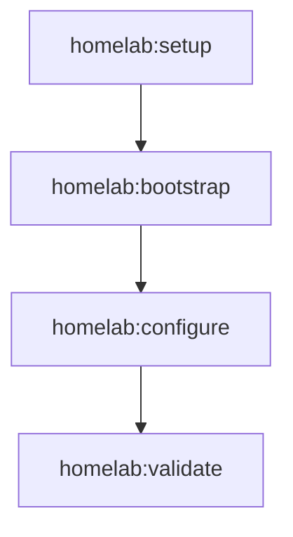

# Homelab execution flow

The standard setup flow now runs only the bootstrap, configure, and validate phases.

Terraform provisioning and Ansible playbook execution have been removed from this repository. The installation tasks for the Ansible and Terraform command-line tools are retained under `task apps:setup`, `task apps:ansible`, and `task apps:terraform`.
